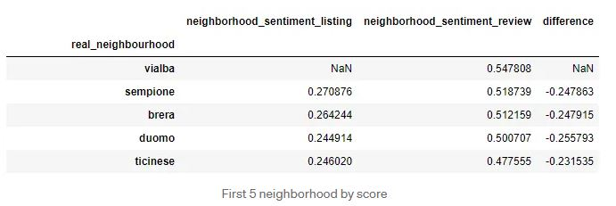
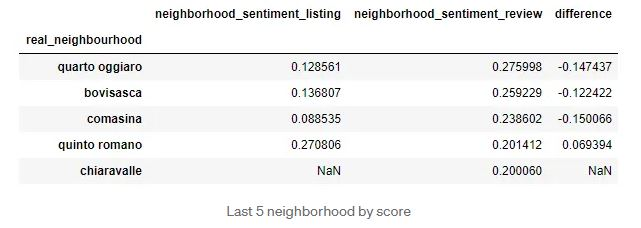
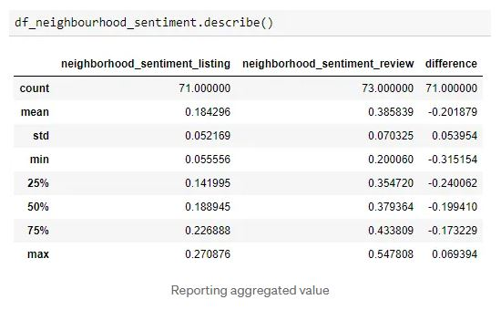

# Write A Data Science Blog Post Project

## Introduction

This project is part of The [Udacity](https://eu.udacity.com/) Data Scientist Nanodegree Program which is composed by:

* Term 1
    * Supervised Learning
    * Deep Learning
    * Unsupervised Learning
* Term 2
    * Write A Data Science Blog Post
    * Disaster Response Pipelines
    * Recommendation Engines

The goal of this project is to put in practice the technical skills teached during the program but manly to focus on the ability to effectively communicate the results of the analysis. In particular the **CRISP-DM Process** (Cross Industry Process for Data Mining) which is composed by the following steps:

1. Business Understanding
2. Data Understanding
3. Prepare Data
4. Data Modeling
5. Evaluate the Results
6. Deploy

## Software and Libraries

This project uses Python 3.11 and the most important packages are:

* [NumPy](http://www.numpy.org/)
* [Pandas](http://pandas.pydata.org)
* [nltk](https://www.nltk.org/)
* [scikit-learn](http://scikit-learn.org/stable/)
* [Matplotlib](http://matplotlib.org/)
* [seaborn](https://seaborn.pydata.org/)
* [TextBlob](https://textblob.readthedocs.io/en/dev/)
* WordCloud

## Local configuration

To setup a new local enviroment and install all dependencies you can run `.\my_scripts\Set-Up.ps1`. It will install:

* [Python](https://www.python.org/)
* [uv](https://docs.astral.sh/uv/)
* [Pre-commit](https://pre-commit.com/)

Pre-commit is a framework for managing and maintaining multi-language pre-commit hooks. A pre-commit hook is a script that runs before a commit operation in a version control system. This allows to shift left code quality checks and remediations. You can change the hooks by updateing the file `.pre-commit-config.yaml`.

To trigger the pre-commit hooks without an actual commit you can run `pre-commit run --all-files -v`.

## Data

Have a look at the `data` folder and its [DATA.md](data/DATA.md) file.

## Testing

No test implemented.

## Running the code

The code is provided in the [Jupyter Notebook](http://ipython.org/notebook.html) _neighborhoods_sentiment_analysis.ipynb_. It will read the data from `DATA_FOLDER` and step by step explore the data TODO.

You can open _neighborhoods_sentiment_analysis.ipynb_ and run each cell and check their results.

You can also run the command `ipython -c "%run neighborhoods_sentiment_analysis.ipynb"`.

To convert the notebook in HTML format run `jupyter nbconvert neighborhoods_sentiment_analysis.ipynb --to html`.

## Results

The goal of the project was to answer to at least three questions related to business or real-world applications of how the data could be used so I have chosen:
1. Which are the 5 neighborhood with highest score?
2. Which are the 5 neighborhood with lowest score?
3. How different is the overview of the neighborhood given from the hosts from the one given by the guests?

The answers to our questions are:

On average the sentiment of the neighborhood given by the contextual sentences of the review of the guests is way higher compared to the **neighborhood_overview** given by the hosts. One possible explanation could be the wide length of the **neighborhood_overview** text that negatively influences the sentiment analysis score. Whereas the extraction of only useful sentences allows to clear up the string used for the analysis, giving an overall higher score.

## List of activities

In the [TODO.md](TODO.md) file you can find the list of tasks and on going activities.

## Licensing and acknowledgements

Have a look at [LICENSE.md](LICENSE.md) and many thanks to [Airbnb](https://www.airbnb.com/) for the datasets and more information about the licensing of the data can be find [here](http://insideairbnb.com/about.html).

## Outro

I hope this repository was interesting and thank you for taking the time to check it out. On my Medium you can find a more in depth [story](https://medium.com/@simone.rigoni01/do-you-want-to-move-to-milan-neighborhoods-sentiment-analysis-using-airbnb-data-72db72ebc070?sk=52ad4741d36bb8a3005b2ad13832d622) and on my Blogspot you can find the same [post](https://simonerigoni01.blogspot.com/2022/12/do-you-want-to-move-to-milan.html) in italian. Let me know if you have any question and if you like the content that I create feel free to [buy me a coffee](https://www.buymeacoffee.com/simonerigoni).
